# Hypothesis Testing

For many analyses in `unmarked`, a primary goal is to determine if a certain covariate affects the state or detection process.
For example, we may want to determine if elevation has an effect on probability of site occupancy, or if wind speed has an effect on detection.
We can formulate this idea as set of statistical hypotheses: the null hypothesis ($H_0$) and the alternative hypothesis ($H_a$):

* $H_0$: There is no effect of elevation on occupancy
* $H_a$: Elevation has an effect on occupancy

In order to test these hypotheses, we must collected appropriate data, perhaps by sampling a series of sites at varying elevation for the presence of the species.
We can then fit a model in `unmarked`, specifying in the formula that we are interested in estimating the effect of elevation on occupancy.
For example, here is a simple model fit to the `crossbill` presence-absence dataset included with `unmarked`:


```r
set.seed(123)
library(unmarked)
data(crossbill)

umf <- unmarkedFrameOccu(y=crossbill[,11:13], 
                         siteCovs=data.frame(elev=scale(crossbill$ele)))
(mod <- occu(~1~elev, umf))
```

```
## 
## Call:
## occu(formula = ~1 ~ elev, data = umf)
## 
## Occupancy:
##             Estimate    SE     z  P(>|z|)
## (Intercept)   -1.223 0.168 -7.27 3.61e-13
## elev           0.594 0.166  3.59 3.35e-04
## 
## Detection:
##  Estimate    SE    z P(>|z|)
##     0.326 0.186 1.75  0.0798
## 
## AIC: 480.8533
```

## Wald tests

In the code{unmarked} output, we obtain an estimate ($\hat{\theta}$) of the regression coefficient associated with elevation (`elev`) along with its standard error.
Our null hypothesis is that elevation has no effect on occupancy, i.e. $\theta_0 = 0$.
With this information, we can conduct a statistical hypothesis test called a Wald test:
$$
\sqrt{W} = \frac{(\hat{\theta} -\theta_0)}{se(\hat{\theta})}
$$

Or simplified:
$$
\sqrt{W} = \frac{(0.5939 - 0)}{0.1656} = 3.59
$$

It turns out that the square root of the Wald statistic, $\sqrt{W}$, follows a standard normal distribution.
Thus, we can calculate the probability that our observed statistic, $\sqrt{W} = 3.59$, occurred by chance assuming that the null hypothesis $\theta = 0$ is true.
In R, for a two-tailed test, this can be calculated as:


```r
z = sqrt_w = coef(mod)[2] / SE(mod)[2]
2*pnorm(abs(z), lower.tail=FALSE)
```

```
##    psi(elev) 
## 0.0003350055
```

This is the p-value. These values we calculated manually match the results that `unmarked` gave us in the summary output.

## Making a conclusion

Before conducting our study, we should have defined a threshold p-value (the significance level or $\alpha$) below which we reject the null hypothesis.
Traditionally, $\alpha = 0.05$.
Our calculated p-value is less than $\alpha$, so we reject the null hypothesis that elevation has no effect on occupancy.

## Types of error

There are two types of errors that we could be making at this point:

1. Type I error: We reject the null hypothesis when in fact it is true. Type I error is conceptually the same as $\alpha$. If we set $\alpha$ larger, we have a greater chance of Type I error.
2. Type II error: We fail to reject the null hypothesis when in fact it is false. This can occur, for example, if we did not have enough data to detect an effect.

In this vignette, we are most concerned with Type II error.
How do we know we have enough data to detect if a covariate has a certain effect?
To answer this question we can use power analysis.

# Power Analysis in unmarked

## Introduction

Statistical power is defined as 1 - Type II error.
So more power means less chance of false negatives, i.e., less chance of failing to reject the null hypothesis when it is false.
Statistical power depends on three other pieces of information:

1. The effect size: the magnitude of the effect of the covariate. The larger the effect, the more power we have to detect it.
2. The sample size: how many sites or surveys we've done. The more samples, the more power we have.
3. The significance level, $\alpha$. The smaller we make $\alpha$, the less power we have: thus there is a tradeoff between Type I and Type II error.

Of the three factors (2) is the one that makes the most sense for researchers to manipulate in order to increase power.
However, increasing the sample size requires additional effort and money - so how large does it need to be?

For many statistical models, mathematical formulas have been developed so that power can be calculated for any combination of values for factors 1-3 above.
This is not true for most occupancy and abundance models available in `unmarked` (but see @Guillera_2012 for one example with occupancy models).
Thus, `unmarked` uses a simulation-based approach for estimating power under various combinations of values for effect size, sample size, and significance level.

## Inputs

When conducting power analysis, `unmarked` needs three pieces of information corresponding to 1-3 above.
Of these, (1) the effect size and (3) the significance level are easy to set depending on our hypotheses and desired Type I error.
The sample size (2) is trickier: it isn't enough to just provide the number of sites, since datasets in `unmarked` also require a variety of other information such as number of surveys per site, number of distance bins, or number of primary periods.
Thus, power analysis in `unmarked` requires a complete dataset in the form of an appropriate `unmarkedFrame`.

In some cases, we may want to calculate power using an already collected dataset.
Importantly, this step must be done \textit{before} running our final analysis.
If power analysis is done after the final model is fit, and the effect sizes are defined based on what was observed in that fitted model, we have done what is called a *post-hoc* power analysis, which is a bad idea (see [this post](https://statmodeling.stat.columbia.edu/2018/09/24/dont-calculate-post-hoc-power-using-observed-estimate-effect-size/) for an example of why this is so bad).
In most cases, the real value of power analysis comes before we actually go collect any data, because it helps us decide how much data to collect.
But how to get an `unmarkedFrame` of data before we've done our study?
Once again the solution is simulation: `unmarked` provides a set of tools for simulating datasets for any of its supported model types.

## Simulating datasets

To simulate a dataset for a given `unmarked` model, we need at a minimum four pieces of information:

1. The type of model (the name of the corresponding fitting function)
2. The covariates affecting each submodel, such as occupancy or detection (supplied as formulas)
3. The effect size for each intercept and covariate
4. Study design parameters such as number of sites and number of surveys

For example, suppose we want to simulate an occupancy dataset (`"occu"`) in which site occupancy is affected by elevation.
The first step is to organize the model structure as a list of formulas, one per submodel.
This list must be named in a specific way depending on the model type.
To get the required names for a given model, fit an example of that model (the documentation should have one) and call `names(model)`.
A single-season occupancy model requires a list with two named components: `state` and `det`.
We supply a formula for each including an effect of elevation on occupancy (note we could name this whatever we want, here we call it `elev`).


```r
forms <- list(state=~elev, det=~1)
```

Next we must tell `unmarked` what the values for the intercept and regression coefficients in each submodel should be.
Once again, this is a named list, one element for each submodel.
Within each element we need a named vector with names that match the covariates in our list of formulas above.
Note also that each must include a value for the intercept term (this can be named `intercept` or `Intercept`).
If we are not sure exactly how to structure this list, just skip it for now: `unmarked` can generate a template for us to fill in later.


```r
coefs <- list(state=c(intercept=0, elev=-0.4), det=c(intercept=0))
```

Finally, we need to give `unmarked` information about the study design.
This is pretty simple: we just need a list containing values for `M`, the number of sites, and `J` the number of surveys per site.
For models with multiple primary periods, we'd also need a value of `T`, the number of primary periods.


```r
design <- list(M=300, J=8) # 300 sites, 8 occasions per site
```

We're now ready to simulate a dataset.
To do this we use the `simulate` function, providing as arguments the name of the model `"occu"` and the three lists we constructed above.
Actually, first, let's not supply the `coefs` list, to show how `unmarked` will generate a template for us to use:


```r
simulate("occu", formulas=forms, design=design)
```


```
## coefs argument should be a named list of named vectors, with the following structure
##         (replacing 0s with your desired coefficient values):
## 
## $state
## intercept      elev 
##         0         0 
## 
## $det
## intercept 
##         0 
## 
## Error : Supply coefs argument as specified above
```

Once we have our covariates set up properly, add them to the function call:


```r
occu_umf <- simulate("occu", formulas=forms, coefs=coefs, design=design)
head(occu_umf)
```

```
## Data frame representation of unmarkedFrame object.
##    y.1 y.2 y.3 y.4 y.5 y.6 y.7 y.8       elev
## 1    0   0   0   0   0   0   0   0 -0.7152422
## 2    0   0   0   0   0   0   0   0 -0.7526890
## 3    0   0   0   0   1   0   1   0 -0.9385387
## 4    0   0   0   0   0   0   0   0 -1.0525133
## 5    1   0   0   0   0   0   1   0 -0.4371595
## 6    0   1   0   1   1   0   0   0  0.3311792
## 7    1   1   1   0   0   0   0   0 -2.0142105
## 8    0   0   0   0   0   0   0   0  0.2119804
## 9    1   0   0   1   0   1   0   0  1.2366750
## 10   0   0   0   0   0   0   0   0  2.0375740
```

`unmarked` has generated a presence-absence dataset as well as values for covariate `elev`.

### Customizing the covariates

By default, a covariate will be continuous and come from a standard normal distribution.
However, we can control this using the `guide` argument.
For example, suppose we want elevation to have a mean of 2 and a standard deviation of 0.5, and we also want a categorical covariate called `landcover`.
The corresponding formulas and list to supply to `guide` would look like this:


```r
forms2 <- list(state=~elev+landcover, det=~1)
guide <- list(landcover=factor(levels=c("forest","grass")), # landcover is factor 
              elev=list(dist=rnorm, mean=2, sd=0.5)) # custom distribution
```

We'd also need an updated `coefs`:


```r
coefs2 <- list(state=c(intercept=0, elev=-0.4, landcovergrass=0.2), det=c(intercept=0))
```


```r
head(simulate("occu", formulas=forms2, coefs=coefs2, design=design, guide=guide))
```

```
## Data frame representation of unmarkedFrame object.
##    y.1 y.2 y.3 y.4 y.5 y.6 y.7 y.8     elev landcover
## 1    0   0   0   0   0   0   0   0 2.063074    forest
## 2    0   0   0   0   0   0   0   0 2.236400    forest
## 3    0   0   0   0   0   0   0   0 1.829623     grass
## 4    0   0   0   0   0   0   0   0 1.879105    forest
## 5    0   0   0   0   0   0   0   0 2.689377     grass
## 6    0   0   0   0   0   0   0   0 1.830558    forest
## 7    0   0   0   0   0   0   0   0 2.010068    forest
## 8    0   0   0   0   0   0   0   0 2.188481     grass
## 9    1   0   1   1   1   0   0   0 1.784138    forest
## 10   0   0   0   0   0   0   0   0 2.979532     grass
```

Our output dataset now includes a new categorical covariate, and the elevation values are adjusted.

### Models that require more information

More complex models might require more information for simulation, such as the distribution to use for abundance with `pcount`.
This information is simply added as additional arguments to `simulate`.
For example, we can simulate a `pcount` dataset using the negative binomial (`"NB"`) distribution.
The negative binomial has an additional parameter to estimate (`alpha`) so we must also add an element to `coefs`.


```r
coefs$alpha <- c(alpha=0.5)
head(simulate("pcount", formulas=forms, coefs=coefs, design=design, mixture="NB"))
```

```
## Data frame representation of unmarkedFrame object.
##    y.1 y.2 y.3 y.4 y.5 y.6 y.7 y.8        elev
## 1    0   0   0   0   0   0   0   0 -1.42329439
## 2    0   0   0   0   0   0   0   0  1.02230366
## 3    0   1   1   0   1   0   0   0  0.68781508
## 4    0   0   0   0   0   0   0   0 -0.30745489
## 5    0   0   1   0   0   1   0   1 -0.01974906
## 6    0   1   1   1   0   0   1   0  0.48839839
## 7    0   0   0   0   0   0   0   0  0.66050081
## 8    0   1   0   1   1   1   0   1 -1.71404333
## 9    0   0   0   0   0   0   0   0  1.45885698
## 10   0   0   0   0   0   0   0   0 -1.40789548
```

## Conducting a power analysis

Power analyses are conducted with the `powerAnalysis` function.
A `powerAnalysis` power analysis depends on the input dataset, as well as the covariates of interest and other settings depending on the model (e.g. the distribution used in an N-mixture model or the detection key function in a distance sampling analysis).
The easiest way combine all this information and send it to `powerAnalysis` is to actually fit a model with all the correct settings and our simulated dataset and send *that* to `powerAnalysis`.
This has the added benefit that it checks to make sure we have all the required information for a valid model.
Note that the actual parameter estimates from this model template don't matter - they aren't used in the power analysis.
Thus, there are two required arguments to `powerAnalysis`: a fitted model template, and a list of effect sizes.

The first step is to fit a model:


```r
template_model <- occu(~1~elev, occu_umf)
```

If we run `powerAnalysis` on `template_model` with no other arguments, `unmarked` will again give us a template for the list of effect sizes, which looks exactly like the one for simulation above.


```r
powerAnalysis(template_model)
```


```
## coefs argument should be a named list of named vectors, with the following structure
##         (replacing 0s with your desired coefficient values):
## 
## $state
## intercept      elev 
##         0         0 
## 
## $det
## intercept 
##         0 
## 
## Error : Supply coefs argument as specified above
```

We will set our desired effect sizes to match what we used for simulation:


```r
effect_sizes <- list(state=c(intercept=0, elev=-0.4), det=c(intercept=0))
```

It is also possible to set the significance level `alpha`; the default is 0.05.
We now have all the required information to conduct the power analysis.
Remember, `unmarked` does this by simulation, so you will see a progress bar as `unmarked` conducts simulations.
You can control how many with the `nsim` argument; we'll set `nsim=20` just to speed things up, but normally you should use more.


```r
(pa <- powerAnalysis(template_model, coefs=effect_sizes, alpha=0.05, nsim=20))
```

```
## 
## Model:
## occu(formula = ~1 ~ elev, data = occu_umf)
## 
## Power Statistics:
##  Submodel   Parameter Effect Null Power
##     state (Intercept)    0.0    0  0.00
##     state        elev   -0.4    0  0.95
##       det (Intercept)    0.0    0  0.00
```

The result is an object `pa` of class `unmarkedPower`.
If you look at `pa` in the console you will get a summary of power for each parameter in the model.
The summary includes the submodel, parameter name, supplied effect size, null hypothesis, and the calculated power based on simulation.
By default the null for each parameter is 0, you can change this by supplying a list to the `nulls` argument with the same structure as `coefs`. 

We have power = 0.95 for the effect of elevation on occupancy probability.
This power is calculated by simulating a bunch of datasets based on the template model and supplied effect sizes, fitting a model to each simulated dataset, and then calculating the proportion of these models for which an effect of the covariate would have been detected at the given value of `alpha`.
You can see the raw results from each simulated model with


```r
pa@estimates
```

### Varying the sample size

One approach to determining how sample size affects power for our model is to simulate a range of `unmarkedFrames` with varying number of sites, observations, etc. and do a power analysis for each.
However `powerAnalysis` also has a argument `design` which can help do this automatically.

The `design` argument will subsample within the original data to generate datasets which are smaller or larger than the original, and conduct power analyses for each scenario.
For example, to test power for a dataset with only 50 sites and 3 sample occasions at each:


```r
# 50 sites and 3 obs per site
(pa2 <- powerAnalysis(template_model, effect_sizes, design=list(M=50, J=3), nsim=20))
```

```
## 
## Model:
## occu(formula = ~1 ~ elev, data = occu_umf)
## 
## Power Statistics:
##  Submodel   Parameter Effect Null Power
##     state (Intercept)    0.0    0   0.0
##     state        elev   -0.4    0   0.1
##       det (Intercept)    0.0    0   0.0
```

With fewer sites and sampling occasions, our power to detect the elevation effect is reduced.

You can also get a larger number of sites via sampling the original sites with replacement:


```r
(pa3 <- powerAnalysis(template_model, effect_sizes, design=list(M=400, J=4), nsim=20))
```

```
## 
## Model:
## occu(formula = ~1 ~ elev, data = occu_umf)
## 
## Power Statistics:
##  Submodel   Parameter Effect Null Power
##     state (Intercept)    0.0    0  0.00
##     state        elev   -0.4    0  0.95
##       det (Intercept)    0.0    0  0.00
```

### Combining unmarkedPower objects

The `unmarkedPowerList` function creates a `unmarkedPowerList` object for holding multiple `unmarkedPower` objects so they can be easily compared.
The summary of an `unmarkedPowerList` is a `data.frame` with all the outputs shown together, including relevant sample sizes.


```r
unmarkedPowerList(list(pa, pa2, pa3))
```

```
##     M T J Submodel   Parameter Effect Null Power
## 1 300 1 8    state (Intercept)    0.0    0  0.00
## 2 300 1 8    state        elev   -0.4    0  0.95
## 3 300 1 8      det (Intercept)    0.0    0  0.00
## 4  50 1 3    state (Intercept)    0.0    0  0.00
## 5  50 1 3    state        elev   -0.4    0  0.10
## 6  50 1 3      det (Intercept)    0.0    0  0.00
## 7 400 1 4    state (Intercept)    0.0    0  0.00
## 8 400 1 4    state        elev   -0.4    0  0.95
## 9 400 1 4      det (Intercept)    0.0    0  0.00
```

We can also create an `unmarkedPowerList` by providing a template model and a range of design scenarios in the `design` argument.
A power analysis will be run for each scenario (sampling the original dataset as shown above) and the results combined.


```r
scenarios <- expand.grid(M=c(50,200,400),
                         J=c(3,5,8))
pl <- unmarkedPowerList(template_model, effect_sizes, design=scenarios, nsim=20)
```

```
## M = 50, J = 3
## M = 200, J = 3
## M = 400, J = 3
## M = 50, J = 5
## M = 200, J = 5
## M = 400, J = 5
## M = 50, J = 8
## M = 200, J = 8
## M = 400, J = 8
```

```r
head(summary(pl))
```

```
##     M T J Submodel   Parameter Effect Null Power
## 1  50 1 3    state (Intercept)    0.0    0  0.00
## 2  50 1 3    state        elev   -0.4    0  0.05
## 3  50 1 3      det (Intercept)    0.0    0  0.00
## 4 200 1 3    state (Intercept)    0.0    0  0.00
## 5 200 1 3    state        elev   -0.4    0  0.70
## 6 200 1 3      det (Intercept)    0.0    0  0.00
```

```r
tail(summary(pl))
```

```
##      M T J Submodel   Parameter Effect Null Power
## 22 200 1 8    state (Intercept)    0.0    0   0.0
## 23 200 1 8    state        elev   -0.4    0   0.7
## 24 200 1 8      det (Intercept)    0.0    0   0.0
## 25 400 1 8    state (Intercept)    0.0    0   0.0
## 26 400 1 8    state        elev   -0.4    0   1.0
## 27 400 1 8      det (Intercept)    0.0    0   0.0
```

There is a built-in `plot` method for `unmarkedPowerList`.
You can specify a target power on the plot to the `power` argument.
You also need to specify the parameter of interest (`"elev"`).


```r
plot(pl, power=0.8, param="elev")
```

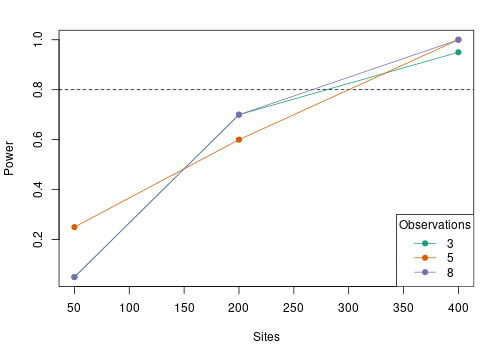

# A more realistic example: Acadian Flycatchers

## Introduction

Normally it is crucial to conduct a power analysis before designing the study or collecting data.
For this example, however, we will demonstrate a more complicated power analysis for a dataset that has already been collected.
The real data (not shown here) are observations of Acadian Flycatchers (ACFL; *Empidonax virescens*) at 50 locations in two habitats over 17 years (2005-2022).
We will assess our power to detect differences in ACFL abundance in between habitats, and our power to detect a trend over time.
We'll test power for three different sample sizes: 25 survey points, 50 survey points, and 100 survey points each sampled once per year for 15 years.

## Simulation

The main input for the `powerAnalysis` function is a fitted `unmarked` model with the desired sample sizes, covariates, and additional arguments included.
In typical situations, you won't have your real dataset collected yet, so you'll have to first generate a simulated dataset that is similar to what your final dataset will look like.
The `simulate` function in `unmarked` can do this for you.

As a reminder the key arguments for `simulate` are `forms`, `coefs`, `design`, and `guide`.
The `forms` argument is a list of formulas, one per submodel.
The covariates named in the formulas will become the covariates included in the final simulated dataset.
We need three covariates associated with abundance (lambda): habitat type, year, and point ID (so that we can include point as a random effect).
For the other submodels we're not including covariates so they are just intercept-only formulas.


```r
forms <- list(lambda = ~Habitat+Year+(1|Point), dist=~1, rem=~1)
```

By default, the covariates we specify in the formulas will be generated randomly from standard normal distributions.
In many cases this is fine, but in our example we need to be more specific given our complex dataset structure.
We need to tell `unmarked` that `Habitat` should be a factor with two levels, and year should take on values 0 through 14 (since we want to have 15 years in the study).
In addition we need the covariates to be structured so that we have 15 rows for point 1 (years 0-14), 15 rows for point 2 (years 0-14) and so on, with each row getting the proper `Point` ID value.
Specifying all this information is the job of the `guide` argument.
We'll supply a custom function for each covariate to `guide`.

First the function for `Point`, the covariate which identifies which survey point each row of the dataset belongs to.
If we have 10 points and we sample each point for 15 years, we'll need 150 total rows (10*15) in our dataset.
The first 15 rows will correspond to point 1, 16-30 for point 2, and so on.
The following function takes the total number of rows `n` as input, figures out how many points that corresponds to (`n/15`), creates a unique ID for each site, and repeats each ID 15 times. 


```r
point_function <- function(n){
  stopifnot(n %% 15 == 0)
  sites <- n/15
  factor(rep(1:sites, each=15))
}
point_function(30) # example
```

```
##  [1] 1 1 1 1 1 1 1 1 1 1 1 1 1 1 1 2 2 2 2 2 2 2 2 2 2 2 2 2 2 2
## Levels: 1 2
```

Next, `Habitat`.
Since each point's `Habitat` value should stay same the same for all 15 years, we need to (1) sample a random `Habitat` value for each point out of two possible habitats, and (2) repeat this value 15 times for each point.
Given a dataset with a number of total rows `n`, the following function figures out how many unique points there should be (`n`/15), samples a habitat for each point, and repeats the value 15 times per point.


```r
hab_function <- function(n){
  stopifnot(n %% 15 == 0)
  sites <- n/15
  hab <- sample(c("A","B"), sites, replace=TRUE)
  factor(rep(hab, each=15))
}
hab_function(30) # example
```

```
##  [1] B B B B B B B B B B B B B B B A A A A A A A A A A A A A A A
## Levels: A B
```

Finally, `Year`.
This function works similarly to the two above, except that for each unique point, it assigns year values from 0-14.


```r
yr_function <- function(n){
  stopifnot(n %% 15 == 0)
  sites <- n/15
  rep(0:14, sites) # 15 years of surveys
}
yr_function(30) # example
```

```
##  [1]  0  1  2  3  4  5  6  7  8  9 10 11 12 13 14  0  1  2  3  4  5  6  7  8  9
## [26] 10 11 12 13 14
```

These functions are combined together in a named list of lists to supply to `guide`.


```r
guide <- list(Point = list(dist=point_function),
              Year = list(dist=yr_function),
              Habitat = list(dist=hab_function))
```

Next, the sample sizes with `design`.
We'll first simulate a dataset with 25 unique points, so we'll need 25*15 site-years since each point is sampled 15 times.
To match the real dataset we'll specify 2 distance bins and 3 removal periods.


```r
design <- list(M = 25*15, Jdist=2, Jrem=3)
```

Since this dataset will have distance bin data in it, we also want to specify how the distance bins will look.
We want two bins, with breaks at 0, 25 m, and 50 m.


```r
db <- c(0,25,50)
```

Finally, we need to provide the parameter values used to actually simulate the response (`y`) according to our specifications (e.g., the intercepts and slopes).
These are provided as a list of vectors to the `coefs` argument.
At this point, we don't actually care what these values are.
We just want to simulate a dataset with the correct structure and covariate values (to use as a template), we don't care what the values in the output `y` matrix actually are since they will be discarded later.
Therefore, we'll just set most parameter values to 0.
However we need to set the distance function intercept to something slightly more realistic - e.g. the log of the median value of the distance breaks.


```r
coefs_temp <- list(lambda = c(intercept=0, HabitatB=0, Year=0, Point=0),
                   dist = c(intercept=log(median(db))), rem=c(intercept=0))
```

We're finally ready to simulate the template dataset with all the pieces created above.
We also need to add a bit more information - our units should be in meters, and we want the output on the abundance scale.


```r
set.seed(1)
umf25 <- simulate("gdistremoval", formulas=forms, design=design, coefs=coefs_temp,
                    guide=guide, unitsIn='m', dist.breaks=db, output='abund')
head(umf25)
```

```
## Data frame representation of unmarkedFrame object.
##    yDist.1 yDist.2 yRem.1 yRem.2 yRem.3 Habitat Year Point
## 1        1       0      1      0      0       A    0     1
## 2        0       0      0      0      0       A    1     1
## 3        1       0      0      0      1       A    2     1
## 4        0       0      0      0      0       A    3     1
## 5        0       0      0      0      0       A    4     1
## 6        1       0      1      0      0       A    5     1
## 7        1       0      1      0      0       A    6     1
## 8        0       1      0      1      0       A    7     1
## 9        0       0      0      0      0       A    8     1
## 10       1       0      1      0      0       A    9     1
```

In the output you can see we have covariates for Habitat, Year, and Point which seem to be structured the way we want.
Remember we don't care what's actually *in* the `y` matrix, we just want it to be the right size.
We can double check that the number of rows in the dataset is correct - it should be 25*15 = 375.


```r
numSites(umf25)
```

```
## [1] 375
```

## Creating the template model

The final step is to fit the correct model to the dataset.
Again, we don't care at all about the *results* of this model, we just want to make sure all the relevant information and arguments are included so that `powerAnalysis` is working with the right information about our proposed study.


```r
mod25 <- gdistremoval(lambdaformula=~Habitat+Year+(1|Point), distanceformula=~1,
                      removalformula=~1, data=umf25, output='abund')
```

## Running the power analysis

With the template model for a 25 point study design in hand, we can now move on to the actual power analysis.
In addition to the template model, we now need to tell `unmarked` what the "true" values of the parameters in the model are.
These are essentially the effect sizes we want to test our ability to identify given our study design.
This is a step where you have to use your expert knowledge to make some guesses about the true state of the system you are studying.

Below are coefficients which describe a system where abundance in Habitat A is roughly 5, Habitat B is roughly 6, abundance declines about 2% per year, and the random variance among points is relatively small (0.1).
Furthermore, the value of the detection function parameter $\sigma$ is equal to the median of the distance breaks (25), and the removal probability of detection is about 0.27.
These are roughly based on our knowledge of the real study system.


```r
coefs <- list(lambda = c(intercept=log(5), HabitatB=0.18,
                         # 2% decline in abundance per year
                         Year=log(0.98),
                         # standard deviation on point random effect
                         Point=0.1),
                         # detection sigma = median distance
                         dist = c(intercept=log(median(db))),
                         # removal p = ~0.27
                         rem = c(intercept=-1))
```

By specifying the `coefs` this way, we will be testing our power to detect that Habitat B has significantly greater abundance than Habitat A, given that the true difference between Habitat B and A is 0.2 units (on the log scale) or 1 bird (on the real scale).
We are also testing our power to detect a significant declining trend in abundance, given that the "true" trend is a yearly decline of about 2%.

Now, run the analysis. 
We're using 50 simulations for speed but you should typically use more.


```r
(pa25 <- powerAnalysis(mod25, coefs=coefs, nsim=100))
```

```
## 
## Model:
## gdistremoval(lambdaformula = ~Habitat + Year + (1 | Point), removalformula = ~1, 
##     distanceformula = ~1, data = umf25, output = "abund")
## 
## Power Statistics:
##  Submodel   Parameter      Effect Null Power
##    lambda (Intercept)  1.60943791    0  1.00
##    lambda    HabitatB  0.18000000    0  0.45
##    lambda        Year -0.02020271    0  0.47
##      dist (Intercept)  3.21887582    0  1.00
##       rem (Intercept) -1.00000000    0  1.00
```

In this case we only care about the `HabitatB` and `Year` rows in the output table, we're ignoring the intercepts.
We found we have weak power (<0.5) to detect both effects with this sample size.

To test the other two sample sizes (50 and 100 sites x 15 years), we just simulate new datasets and repeat the process.
We only need to change the `design` argument to simulate.


```r
umf50 <- simulate("gdistremoval", formulas=forms, 
                  design=list(M = 50*15, Jdist=2, Jrem=3), # change here
                  coefs=coefs_temp,
                  guide=guide, unitsIn='m', dist.breaks=db, output='abund')
mod50 <- gdistremoval(lambdaformula=~Habitat+Year+(1|Point), distanceformula=~1,
                      removalformula=~1, data=umf50, output='abund')
pa50 <- powerAnalysis(mod50, coefs=coefs, nsim=100)

umf100 <- simulate("gdistremoval", formulas=forms, 
                  design=list(M = 100*15, Jdist=2, Jrem=3), # change here
                  coefs=coefs_temp,
                  guide=guide, unitsIn='m', dist.breaks=db, output='abund')
mod100 <- gdistremoval(lambdaformula=~Habitat+Year+(1|Point), distanceformula=~1,
                      removalformula=~1, data=umf100, output='abund')
pa100 <- powerAnalysis(mod100, coefs=coefs, nsim=100)
```

## Examining the results

In addition to looking at the summary table outputs of `pa25`, `pa50`, and `pa100`, they can also be combined into an `unmarkedPowerList` for easier comparison.


```r
(pl <- unmarkedPowerList(list(pa25, pa50, pa100)))
```

```
##       M T J Submodel   Parameter      Effect Null Power
## 1   375 1 3   lambda (Intercept)  1.60943791    0  1.00
## 2   375 1 3   lambda    HabitatB  0.18000000    0  0.45
## 3   375 1 3   lambda        Year -0.02020271    0  0.47
## 4   375 1 3     dist (Intercept)  3.21887582    0  1.00
## 5   375 1 3      rem (Intercept) -1.00000000    0  1.00
## 6   750 1 3   lambda (Intercept)  1.60943791    0  1.00
## 7   750 1 3   lambda    HabitatB  0.18000000    0  0.58
## 8   750 1 3   lambda        Year -0.02020271    0  0.80
## 9   750 1 3     dist (Intercept)  3.21887582    0  1.00
## 10  750 1 3      rem (Intercept) -1.00000000    0  1.00
## 11 1500 1 3   lambda (Intercept)  1.60943791    0  1.00
## 12 1500 1 3   lambda    HabitatB  0.18000000    0  0.97
## 13 1500 1 3   lambda        Year -0.02020271    0  0.96
## 14 1500 1 3     dist (Intercept)  3.21887582    0  1.00
## 15 1500 1 3      rem (Intercept) -1.00000000    0  1.00
```

There's a default plotting method for `unmarkedPowerLists`.
You need to specify the parameter of interest, and you can optionally define a target power level to add to the plot:


```r
plot(pl, par="HabitatB", power=0.8)
```

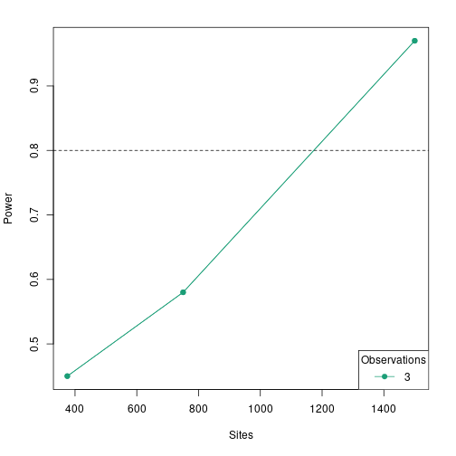

```r
plot(pl, par="Year", power=0.8)
```

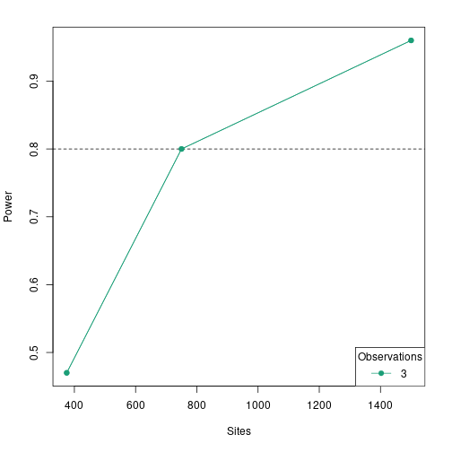

Note that the x-axis shows sites as the number of site-years (e.g., sites x years).
It looks like only the largest tested sample size (100 sites) has power > 0.8 to detect a significant effect of habitat type and year in the correct direction.

# Shiny webapp

`unmarked` now includes a [Shiny](https://shiny.posit.co/) webapp that can be used to conduct power analyses.
The Shiny app is launched with the `shinyPower()` function, which takes as a template model as an input argument (see above).
This function opens a window in your web browser.
Once the application is loaded, you can experiment with different settings and generate summaries and figures for the resulting power estimates.

## Demonstration

First, we simulate a template model for a single-species occupancy analysis, using the `simulate` function as described above.
We have one covariate of interest on occupancy (`elev`) and one on detection (`wind`).


```r
umf <- simulate("occu", formulas=list(state=~elev, det=~wind),
                coefs=list(state=c(intercept=0, elev=0.3),
                           det=c(intercept=0.4, wind=-0.2)),
                design=list(M=100, J=5))

(mod <- occu(~wind~elev, umf))
```

```
## 
## Call:
## occu(formula = ~wind ~ elev, data = umf)
## 
## Occupancy:
##             Estimate    SE      z P(>|z|)
## (Intercept)  -0.0624 0.203 -0.308   0.758
## elev          0.1965 0.232  0.849   0.396
## 
## Detection:
##             Estimate    SE      z  P(>|z|)
## (Intercept)   0.4736 0.137  3.457 0.000546
## wind         -0.0599 0.125 -0.479 0.632033
## 
## AIC: 463.2808
```

Next call the `shinyPower` function on our template model, which starts the Shiny app in your web browser.


```r
shinyPower(mod)
```

A demo version of the app you can experiment with can be found [here](https://kenkellner.shinyapps.io/unmarked-power/).
The next section provides a more detailed tutorial for the app using screenshots.

## Tutorial

### Inputs

The shaded vertical bar on the left is where we set the options for the analysis
At the top left you will see the name and type of the model you provided to `shinyPower`.

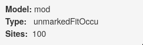

Next you can set the value for $\alpha$, and the number of simulations to run in each power analysis.
The default is 10, but you should usually set it to something higher.

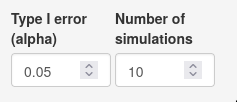

After that you can, if you wish, specify one or more sample size scenarios by manipulating the number of sites and number of observations.
If you set a number of sites/observations smaller than what was in the original template model dataset, the dataset will be subsampled; if larger, the new dataset(s) will be bootstrapped.
It's a good idea to simulate the template model with the largest sample size you want to test here to avoid the bootstrapping.

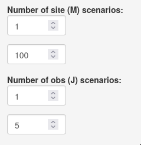

Next you must set the effect sizes you want to test in the power analysis.
Each submodel has its own section.
In this case state = occupancy and det = detection.
Effect sizes for all parameters in the model default to 0; you'll want to change them to reflect your expectations about the study system.
Here we are simulating datasets with an elevation effect of 0.4 (on the logit scale), with occupancy and detection intercepts equal to 0 (equivalent to probabilities of 0.5).

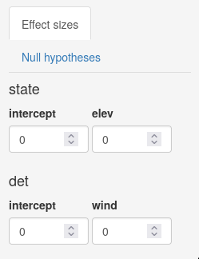

You can also set the null hypotheses manually if you want by clicking on the "Null hypotheses" tab.
By default they are all set at 0.

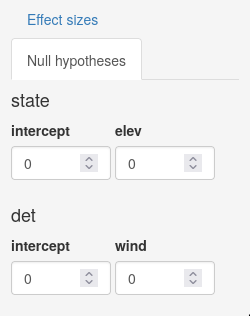

Finally, click the run button.
You should see one or more progress bars in the lower right of the application.

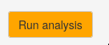

### Outputs

To the right of the input sidebar is a set of tabs showing output.
The "Summary" tab shows a table with estimates of power for each parameter under each scenario you specified earlier.
The "Plot" tab shows a plot of how power changes for a given parameter based on sample size (it will not be useful if you only have one sample size scenario).
Here's the first few lines of a summary table with three scenarios for number of sites (100, 75, 50) and two for number of observations (2, 5), testing for an `elev` effect size of 0.4:

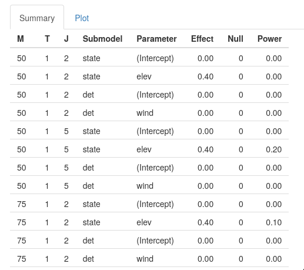

And the corresponding summary figure for `elev`:

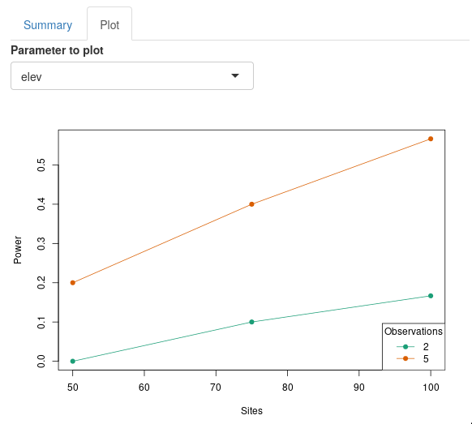

# Conclusion

Power analysis is an important step in the research process that is often overlooked in studies of animal abundance and occurrence.
Getting an estimate of the sample size required to detect a particular effect can help with efficient data collection and set expectations for what covariate relationships might be possible to detect.
The power analysis tools in `unmarked` should help make this part of the research process quick and easy for researchers as the begin to develop study designs.

# References
